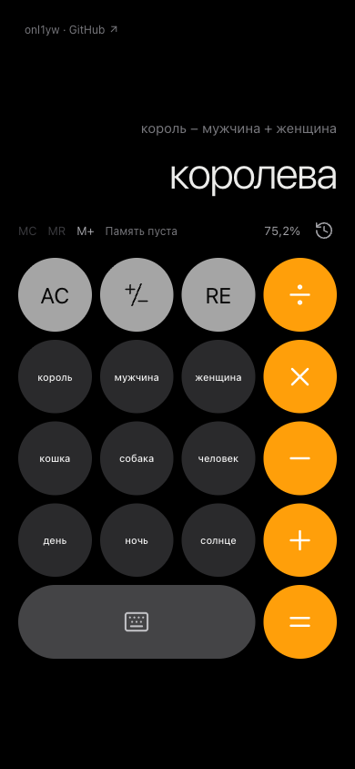
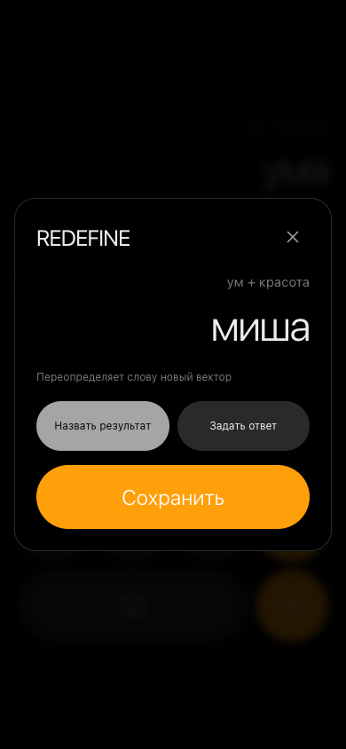

# Semantic Calculator

**Калькулятор, в котором вместо чисел — слова.**

```text
король − мужчина + женщина ≈ королева
```

**[Открыть калькулятор ↗](https://calc.sh1sha.ru)** ·
[Как устроена модель](docs/model.md) · [Локальный запуск](#локальный-запуск)

Введите русское слово или выражение. Калькулятор выполнит арифметику над
векторами слов и покажет ближайшее слово из словаря. Знакомый интерфейс
калькулятора помогает экспериментировать с отношениями между понятиями.

<p align="center">
  
  
</p>

## Что можно делать

- Складывать, вычитать, умножать и делить векторы слов, менять знак результата.
- Вводить выражение целиком или продолжать вычисление кнопками.
- Пользоваться памятью `M+`, `MR`, `MC` и возвращаться к истории.
- Нажать `RE`, чтобы назвать свой результат или задать личный ответ для выражения.
- Редактировать определения в «Моём словаре».

История, память и личные определения сохраняются в браузере между посещениями.
У каждой ревизии модели свой личный словарь.

## Какая модель используется

Используются готовые веса **Word2Vec Skipgram** из
[RusVectōrēs / NLPL](https://rusvectores.org/ru/models/):
`ruwikiruscorpora_upos_skipgram_300_2_2019`.

| Параметр | Значение |
| --- | --- |
| Корпус | Национальный корпус русского языка и русская Википедия за декабрь 2018 года |
| Размерность вектора | 300 |
| Словарь приложения | 57 568 существительных из 248 978 исходных записей |

Каждое слово представлено вектором. Например, из вектора «король» вычитается
вектор «мужчина» и прибавляется вектор «женщина». Ближайший к результату вектор
в выбранном словаре принадлежит слову **«королева»**.

Процент на экране показывает косинусную близость векторов. Другие выражения
могут давать неожиданные ответы: результат зависит от контекстов, на которых
обучена модель, и от доступного словаря. Ввод базовых слов ограничен
существительными; личные определения позволяют добавлять свои имена.

Модель опубликована RusVectōrēs / NLPL; автор, указанный в метаданных, —
Andrey Kutuzov. Каталог распространяет модели на условиях **CC BY**.
[Источник, атрибуция и подготовка данных →](docs/model.md)

## Как устроено приложение

**React + TypeScript** отвечают за интерфейс, арифметику и состояние в браузере.
**FastAPI + NumPy** предоставляют подсказки, векторы слов и точный поиск по
косинусной близости. Публичный сервис работает в **Yandex Cloud**: словарь и
матрица включены в образ приватного контейнера. Все словарные операции
выполняются локально, без запросов в облачную базу.

Локальный запуск использует файлы словаря. Архивы модели, базы, выгрузки,
секреты и состояние Terraform исключены из Git.

## Локальный запуск

Нужны **Python 3.12+** и **Node.js 22.12+**. Проверки CI используют Python 3.14
и Node.js 22.

```bash
python3 -m venv .venv
.venv/bin/python -m pip install -r requirements.lock.txt
npm ci --prefix frontend
.venv/bin/python scripts/prepare_model.py
bash scripts/dev.sh
```

Откройте [http://127.0.0.1:8000](http://127.0.0.1:8000).
При первом запуске подготовки скачивается архив размером около **638 МБ**;
подготовленный словарь занимает ещё около **221 МБ**. Повторная подготовка
проверяет SHA-256 существующих файлов и использует их снова.

Для разработки интерфейса запустите `npm run dev --prefix frontend` параллельно
с backend и откройте порт 5173. Подробнее — в [CONTRIBUTING.md](CONTRIBUTING.md).

## Проверки

```bash
.venv/bin/python -m pytest -q
npm test --prefix frontend
npm run build --prefix frontend
```

Тесты используют небольшие словари и работают без скачивания модели.

## Документация

- [Модель, поиск и формат данных](docs/model.md)
- [Вычисления, память и личные определения](docs/calculator.md)
- [Разработка и структура проекта](CONTRIBUTING.md)
- [Развёртывание в Yandex Cloud](docs/deployment.md)
- [Безопасность и сообщения об уязвимостях](SECURITY.md)

## Автор и лицензия

Автор — **Михаил Шифрин ([onl1yw](https://github.com/onl1yw))**.

Код и оригинальные материалы проекта распространяются по
[Semantic Calculator Attribution License 1.0](LICENSE). Их можно копировать,
изменять и использовать, в том числе коммерчески, при сохранении указания автора,
ссылки на исходный проект и текста лицензии. В опубликованном приложении или
сервисе упоминание автора должно быть видно в интерфейсе или доступном разделе
«О проекте», «Авторы» или «Лицензия». Использование копий без этой атрибуции запрещено.

Условия сторонних моделей, иконок и зависимостей приведены в [NOTICE](NOTICE).
