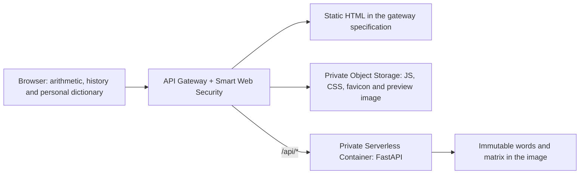

# Yandex Cloud: serverless with a local dictionary

## Architecture



Prefix suggestions use a sorted local word index; word lookup reads the immutable
matrix through a read-only memory map. Exact nearest search uses the same 66 MiB
matrix. All dictionary operations work without outbound network connections.
The application has no cloud database, database SDK, or dictionary import step.

The image contains `manifest.json`, `words.json`, and `vectors.npy`. Startup checks
the words and matrix against their SHA-256 hashes in the manifest. A corrupt
snapshot prevents startup. Model revisions are released as immutable image digests;
updating the model requires rebuilding and deploying the image.

The browser communicates with one HTTPS origin. History, memory, and personal
definitions remain in localStorage. The server persists no user calculations.

The gateway returns the small HTML document directly, preserving its browser
security headers. Static assets are read from a private STANDARD Object Storage
bucket using the gateway account. GET and HEAD are supported for static routes.
Only API routes invoke the container. The browser renders the interface before
its one initial `/api/health` request finishes; that request starts a cold
dictionary instance in the background. There is no keepalive polling.

Frontend releases use immutable versioned keys for HTML, favicon, preview image
and attribution files. Vite's hashed JS/CSS keys remain available across releases,
so an already-open page can finish loading its assets after an update. HTML and
preview files use `no-cache`; hashed assets use a one-year immutable cache.
The static bucket has a 64 MiB size limit and denies anonymous read/list/config
access. Public access goes through the same protected gateway.

## Limits

| Layer | Configuration |
| --- | --- |
| SWS / ARL | Nearest: 30/min; dictionary API: 120/min; other traffic: 600/min |
| Container instances | **1 per availability zone**; this is not a global maximum of 1 |
| Concurrent incoming requests | 4 per zone, 4 per instance |
| Prepared instances | 0 |
| Container resources | 1 core at 20%, 256 MiB, one Uvicorn process |
| Container execution | 3 seconds |
| Gateway timeout (including cold start) | 10 seconds |
| Dictionary workers | 2, fail fast when busy |
| Application API / search | 240/min and 60/min per process, with small bursts |
| Request body | 16 KiB |

ARL rules run in enforcement mode. Specific rules precede the catch-all; each path
has a quota. The release script verifies container limits before granting the
gateway invocation rights. The provider does not expose the two zone caps, so the
revision is deployed through `yc` with those flags set explicitly.
The gateway remains disconnected for five minutes while new zone limits propagate.
An existing gateway's invocation binding is temporarily removed during an update;
the application is unavailable during this release window.

Container and application limits cannot prevent charges for every possible attack.
SWS bills requests allowed through its rules; blocked requests and ARL processing
are not billed. Allowed traffic below the rate limits can still incur charges.
Configure billing alerts scoped to the project folder; alerts do not automatically
stop spending. Cloud-wide quota changes could affect unrelated projects.

Official references:

- [Container scaling and zone limits](https://yandex.cloud/ru/docs/serverless-containers/concepts/container#scaling)
- [Gateway integration with Smart Web Security](https://yandex.cloud/ru/docs/api-gateway/concepts/extensions/sws)
- [Smart Web Security pricing](https://yandex.cloud/ru/docs/smartwebsecurity/pricing)

## Prepare and review

Use a dedicated folder named `semantic-calculator`. Terraform verifies the folder
name and cloud before creating resources. It manages only the registry,
runtime and gateway identities, their scoped bindings, and SWS profiles.
Keep this project's state separate from every other project's state.

The checked-in provider is version 0.230.0 with checksums for macOS ARM64 and Linux
AMD64. The project CLI configuration uses Yandex's provider mirror. The wrapper
captures a short-lived IAM token from the configured `yc` profile without printing
it or storing it in the Terraform configuration. Install Terraform 1.10+ and `yc`
or place a verified Terraform binary in `output/tools/terraform`.

```bash
.venv/bin/python scripts/terraform_yandex.py init
.venv/bin/python scripts/terraform_yandex.py validate
.venv/bin/python scripts/terraform_yandex.py plan \
  --cloud-id YOUR_CLOUD_ID --folder-id YOUR_FOLDER_ID \
  -out=../../output/semantic-cloud.tfplan

docker build --platform linux/amd64 -t semantic-calculator:local .
```

Only the three runtime dictionary files enter the image. Model archives, raw
weights, SQLite databases, secrets, Terraform state, and build caches are excluded.
The runtime uses UID 10001. Base images are pinned by digest.

## Create the private foundation

Apply the reviewed plan, then save the public deployment identifiers locally:

```bash
.venv/bin/python scripts/terraform_yandex.py apply \
  --cloud-id YOUR_CLOUD_ID --folder-id YOUR_FOLDER_ID \
  ../../output/semantic-cloud.tfplan
.venv/bin/python scripts/terraform_yandex.py output -json deployment \
  > output/foundation.json
```

Prepare the dictionary with `scripts/prepare_model.py` before building the image.
The runtime needs no database credentials or database upload. Keep deployment
identifiers and Terraform state in ignored local files.

## Release

Build the production frontend before either release command:

```bash
npm ci --prefix frontend
npm run build --prefix frontend
```

For an interface-only release, publish static objects first and update gateway
routes without redeploying the API or removing its invocation binding:

```bash
.venv/bin/python -m scripts.deploy_frontend \
  --foundation output/foundation.json
```

This previews the static publication. Add `--apply` to publish and switch the
gateway. Files are checksum-verified before connecting the new frontend. Previous
release objects are retained for rollback; check bucket usage before it reaches
the size limit. The script records the previous gateway metadata and new spec in
ignored local release files.

Authenticate Docker to the project's registry with a short-lived IAM token via
`--password-stdin`. Push the image to
`cr.yandex/REGISTRY_ID/semantic-calculator:VERSION` and obtain its registry digest.
Do not put tokens in build arguments or image environment variables.

```bash
.venv/bin/python -m scripts.deploy_yandex \
  --foundation output/foundation.json \
  --image cr.yandex/REGISTRY_ID/semantic-calculator@sha256:DIGEST
```

This previews the bounded revision command. Add `--apply` to deploy. The script
checks folder isolation, inherited IAM exposure, private container rights, and the
active revision's actual zone and resource limits. It also verifies that dictionary
integrity checks are enabled and obsolete database environment variables are absent.
It probes the
private container with IAM, checks the model revision, and verifies unauthenticated
direct invocation is denied. It then connects
the gateway with mandatory SWS protection and explicit API/frontend routes.

The runtime account can pull images only from the project's registry. No
authorized-key files or static cloud credentials are needed in the container.
The gateway account can invoke this container and read only the project's static bucket.

## Custom domain

For `calc.sh1sha.ru`, keep the existing `sh1sha.ru` DNS zone. Request a managed
Certificate Manager certificate for this hostname, add its DNS validation CNAME,
and wait for `ISSUED`. Keeping the validation CNAME allows automatic renewal.

Read the gateway's actual `domain` field from `yc serverless api-gateway get`.
Add `calc.sh1sha.ru. 600 CNAME GATEWAY_SERVICE_DOMAIN.` in the existing zone;
do not derive the service domain from the gateway ID. Attach the issued certificate:

```bash
yc serverless api-gateway add-domain --id GATEWAY_ID \
  --domain calc.sh1sha.ru --certificate-id CERTIFICATE_ID \
  --folder-id PROJECT_FOLDER_ID --cloud-id CLOUD_ID
```

Check that the attachment is enabled and HTTPS works without bypassing certificate
validation. Preserve existing root, mail, game, and certificate-validation records.
See [Yandex's custom-domain instructions](https://yandex.cloud/ru/docs/api-gateway/operations/api-gw-domains).

## Acceptance and emergency stop

After release, check the gateway page and assets, suggestions, vectors, and
`король − мужчина + женщина = королева`. Verify that an unauthenticated direct
container request is denied and that neither gateway nor container exposes `/data`,
`/models`, or `.env`. Inspect the active revision's limits and the SWS rules.
Measure cold-start response time in the cloud separately from local startup.

To stop public traffic to this project, stop its API gateway:

```bash
yc serverless api-gateway stop --id GATEWAY_ID \
  --folder-id PROJECT_FOLDER_ID --cloud-id CLOUD_ID
```

Removing the gateway's container invocation binding stops compute access but leaves
the public gateway handling requests. Preserve the registry and Terraform state.
Resume the gateway only after checking the active revision and billing metrics.
See [Yandex's stop and resume instructions](https://yandex.cloud/ru/docs/api-gateway/operations/api-gw-stop-resume).
